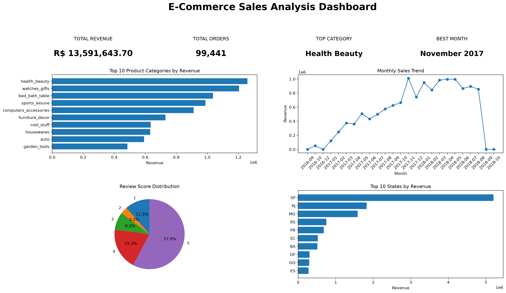

# E-Commerce Sales Analysis

## Project Overview

This project analyzes Brazilian e-commerce sales data to identify sales trends, top-performing product categories, regional performance, average order value, and customer review patterns.

The analysis was performed using Python, Pandas, Matplotlib, Seaborn, and Jupyter Notebook.

## Project Objectives

The main objectives of this project are:

- Clean and prepare the e-commerce datasets
- Identify the highest-revenue product category
- Identify the peak sales month
- Analyze regional/state sales performance
- Calculate Average Order Value (AOV)
- Analyze customer review scores
- Create business visualizations
- Build a one-page management dashboard
- Provide business insights and recommendations

## Key Performance Indicators

| KPI | Result |
|---|---:|
| Total Revenue | R$ 13,591,643.70 |
| Total Orders | 99,441 |
| Top Category | Health & Beauty |
| Top Category Revenue | R$ 1,258,681.34 |
| Best Month | November 2017 |
| Best Month Revenue | R$ 1,010,271.37 |
| Average Order Value | R$ 136.68 |

## Visualizations

The project contains the following visualizations:

1. Top 10 Product Categories by Revenue
2. Monthly Sales Trend
3. Top 10 States by Revenue
4. Monthly Average Order Value Trend
5. Review Score Distribution
6. Revenue by Product Category and Month Heatmap

## Dashboard

A one-page dashboard was created to provide a quick overview of the analysis.

The dashboard includes:

- Total Revenue
- Total Orders
- Top Product Category
- Best Sales Month
- Top Product Categories
- Monthly Sales Trend
- Review Score Distribution
- Top States by Revenue



## Business Insights

### 1. Health & Beauty is the highest-revenue product category

Health & Beauty generated the highest revenue among the product categories analyzed, with approximately R$ 1.26 million in revenue.

**Recommendation:**  
Maintain strong availability of Health & Beauty products and consider targeted promotions, bundles, and cross-selling opportunities.

### 2. November 2017 recorded the highest monthly revenue

November 2017 was the peak sales month, generating R$ 1,010,271.37 in revenue.

**Recommendation:**  
Study the promotions, product demand, and purchasing patterns during high-performing periods when planning future campaigns.

### 3. São Paulo generated the highest regional revenue

São Paulo (SP) recorded the highest revenue among the customer states analyzed.

**Recommendation:**  
Prioritize inventory availability and delivery capacity in high-revenue states while exploring opportunities to increase sales in lower-performing regions.

### 4. Average Order Value was R$ 136.68

The overall Average Order Value was R$ 136.68.

**Recommendation:**  
Use product bundles, complementary-product recommendations, and minimum-order promotions to encourage higher-value purchases.

### 5. 5-star reviews represented the largest share of reviews

5-star reviews accounted for 57.8% of all reviews, while 4-star reviews accounted for 19.3%.

**Recommendation:**  
Maintain the factors contributing to positive customer experiences while analyzing lower-rated reviews to identify recurring problems.

## Surprising Finding

Health & Beauty was the highest-revenue product category, generating approximately R$ 1.26 million.

The review data also shows that 5-star reviews made up 57.8% of all reviews, while 1-star reviews accounted for 11.5%.

This shows a large concentration of highly positive customer ratings alongside a smaller but significant group of low ratings.

## Tools and Technologies

- Python
- Pandas
- Matplotlib
- Seaborn
- Jupyter Notebook
- VS Code

## Project Structure

```text
ECommerce-Sales-Analysis/
│
├── README.md
├── .gitignore
├── dashboard.png
├── requirements.txt
│
├── notebooks/
│   └── ECommerce_Sales_Analysis.ipynb
│
├── outputs/
│
└── data/
    └── Olist datasets